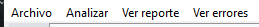
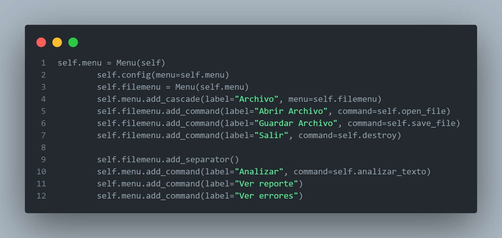
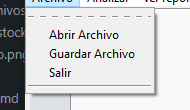

# Lenguajes Formales y de Programación
## Proyecto 1 
### Semestre 2 2023
```js
Universidad San Carlos de Guatemala
Programador: Miguel Ricardo Galicia Urrutia
Carne: 202201117
Correo: galiciar319@gmail.com
```
---
## Descripción del Proyecto
El programa debera realizar operaciones matematicas por medio de un analisis lexico, las intrucciones deberan ser importadas en un archivo JSON para el analisis correcto, los archivos dentro del modulo Expresiones son aquellos donde ya hecho el analisis estos realizaran las operaciones. El archivo analizador contiene los metodos de lectura y analisis de la entrada de datos, el archivo interfaz cuenta con la interfaz de usuario y se creo un ejecutable para la ejecucion del programa.

#### Cinta de opciones ####

La cinta de opciones cuienta con 4 pestañas, Archivo, analizar, ver reporte y ver errores.




#### Pestaña Archivo ####

Esta pestaña cuenta con las opciones de Agregar archivo, guardar archivo y salir, la opcion de agregar archivo abre un seleccionador de archivos que solo busca archivos .json, la opcion de guardar archivo guarda el archivo en la ruta que se le indique y la opcion de salir cierra el programa.


#### Pestaña analizar ####

Llama el metodo analizar del archivo analizador para que luego sea interpretado segun la operacion que este contenga, si la operacion es correcta se mostrara el resultado en la pestaña de ver reporte, si la operacion es incorrecta se mostrara el error en la pestaña de ver errores.

#### Pestaña ver reporte ####

#### Pestaña ver errores ####

Si el usuario ingresa una opción inválida, el programa muestra un mensaje de error y solicita una nueva opción válida hasta que el usuario proporcione una opción correcta.
